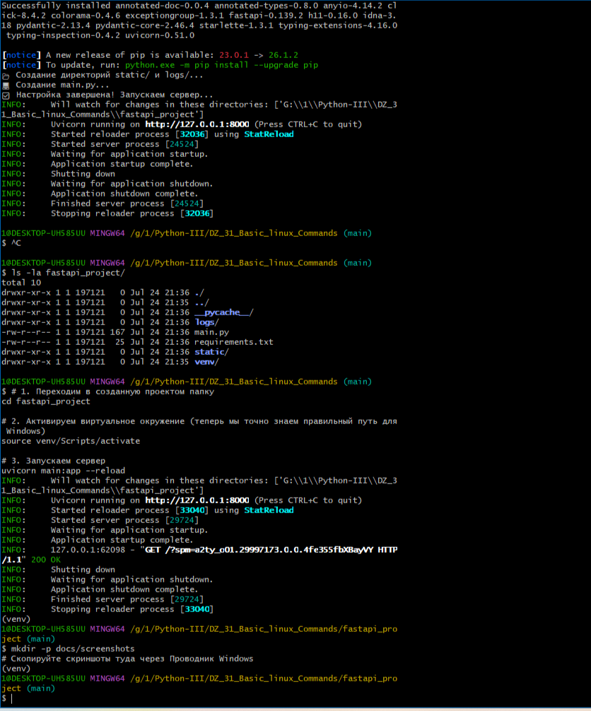
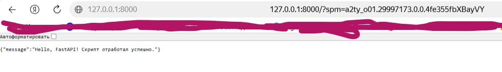
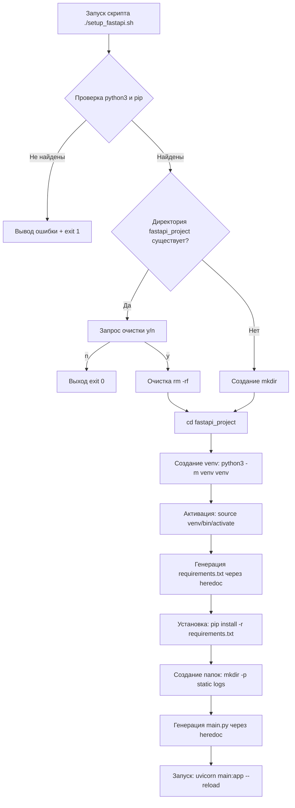

cat << 'READMEEOF' > README.md
#  DZ31 — Основные команды Linux и Bash-скрипты

[](https://www.gnu.org/software/bash/)
[](https://fastapi.tiangolo.com/)
[](https://www.python.org/)
[]()

**Автор:** Виктор Куличенко  
**Занятие:** #31 — Основные команды Linux  
**Статус:** ✅ Завершено

---

## 📌 О проекте

В рамках этого задания разработан автоматизированный Bash-скрипт `setup_fastapi.sh`, который выполняет полную инициализацию, настройку и запуск нового FastAPI-проекта. Скрипт демонстрирует навыки работы с файловой системой Linux, управления процессами, условными операторами и циклами.

### 🎯 Ключевые возможности скрипта:
- ✅ Проверка наличия системных зависимостей (`python3`, `pip`)
- ✅ Безопасная обработка существующих директорий (запрос подтверждения)
- ✅ Автоматическое создание и активация виртуального окружения (`venv`)
- ✅ Генерация файлов `requirements.txt` и `main.py` через heredoc (`cat <<EOF`)
- ✅ Создание структуры каталогов (`static/`, `logs/`)
- ✅ Автоматический запуск сервера Uvicorn с флагом `--reload`

---

##  Быстрый старт

### Для пользователей Linux / macOS / WSL / Git Bash (Windows):

1. Склонируйте репозиторий:
```bash
   git clone https://github.com/VictorKVS/DZ_31_Basic_linux_Commands.git
   cd DZ_31_Basic_linux_Commands
```
2. Сделайте скрипт исполняемым:
```bash
   chmod +x setup_fastapi.sh
```

3. Запустите скрипт:
```bash
     ./setup_fastapi.sh
```
4. Откройте в браузере: http://127.0.0.1:8000

##  📋 Требования ДЗ 31
##  ✅ Основное задание:

## 📋 Требования ДЗ 31

### ✅ Основное задание:

| Требование | Статус | Реализация |
|------------|--------|------------|
| Создание директории `fastapi_project` | ✅ | `mkdir fastapi_project` |
| Переход в директорию | ✅ | `cd fastapi_project` |
| Инициализация виртуального окружения | ✅ | `python3 -m venv venv` |
| Активация venv | ✅ | `source venv/bin/activate` |
| Создание `requirements.txt` | ✅ | Heredoc с fastapi, uvicorn, pydantic |
| Установка зависимостей | ✅ | `pip install -r requirements.txt` |
| Создание структуры (`static/`, `logs/`, `main.py`) | ✅ | `mkdir -p` + heredoc |
| Запуск сервера FastAPI | ✅ | `uvicorn main:app --reload` |

### ✅ Дополнительные требования:

| Требование | Статус | Реализация |
|------------|--------|------------|
| Проверка наличия Python и pip | ✅ | `command -v python3` |
| Обработка ошибок с сообщением | ✅ | `exit 1` + вывод в stderr |
| Обработка существующей директории | ✅ | Запрос подтверждения `read -p` |
| Использование `set -e` | ✅ | Немедленная остановка при ошибке |

---

## 🐧 Изученные команды Linux

| Команда | Назначение | Пример использования |
|---------|------------|----------------------|
| `ls` | Просмотр содержимого директории | `ls -la fastapi_project/` |
| `cd` | Смена текущей директории | `cd fastapi_project` |
| `mkdir` | Создание директории | `mkdir -p static logs` |
| `rm` | Удаление файлов/директорий | `rm -rf "$PROJECT_DIR"/*` |
| `chmod` | Изменение прав доступа | `chmod +x setup_fastapi.sh` |
| `cat` | Вывод содержимого / heredoc | `cat <<EOF > file.txt` |
| `source` | Выполнение команд из файла | `source venv/bin/activate` |
| `echo` | Вывод текста в терминал | `echo "✅ Готово!"` |
| `command -v` | Проверка наличия команды в PATH | `command -v python3` |
| `read -p` | Чтение ввода пользователя | `read -p "Продолжить? (y/n): " choice` |
| `exit` | Завершение скрипта с кодом | `exit 1` (ошибка), `exit 0` (успех) |

## 📸 Демонстрация работы

### 1. Успешный запуск скрипта в Git Bash

*Вывод скрипта: проверка зависимостей, создание venv, установка пакетов, запуск Uvicorn.*

### 2. Работающее FastAPI-приложение в браузере

*JSON-ответ от сервера: `{"message": "Hello, FastAPI! Скрипт отработал успешно."}`*

---

## 🏗️ Архитектура Bash-скрипта


## 🔐 Best Practices в Bash-скриптах

✅ **Реализовано в скрипте:**

| Практика | Описание | Пример из скрипта |
|----------|----------|-------------------|
| `set -e` | Немедленная остановка при ошибке | Первая строка скрипта |
| Проверка команд | Использование `command -v` вместо прямого вызова | `if ! command -v python3` |
| Кавычки для переменных | Защита от пробелов в путях | `"$PROJECT_DIR"` |
| Перенаправление ошибок | Скрытие шумных ошибок | `2>/dev/null \|\| true` |
| Heredoc (`<<EOF`) | Чистая генерация многострочных файлов | `cat << 'EOF' > main.py` |
| Обработка существующих данных | Запрос подтверждения у пользователя | `read -p "Хотите очистить? (y/n)"` |
| Fallback-логика | Альтернативные пути выполнения | `python3 -m venv \|\| python -m venv` |

---

## 🛠️ Стек технологий

| Категория | Технология | Назначение |
|-----------|------------|------------|
| **Shell** | Bash 5.0+ | Язык скрипта |
| **Web Framework** | FastAPI | Асинхронный API |
| **ASGI Server** | Uvicorn | Запуск FastAPI |
| **Валидация** | Pydantic | Модели данных |
| **Python** | 3.10+ | Язык приложения |
| **ОС** | Linux / Git Bash (Windows) | Среда выполнения |

---

## 📊 Статистика проекта

| Показатель | Количество | Детали |
|------------|------------|--------|
| 📜 **Bash-команд** | 11 | ls, cd, mkdir, rm, chmod и др. |
| 📁 **Созданных директорий** | 4 | fastapi_project, venv, static, logs |
| 📄 **Сгенерированных файлов** | 2 | main.py, requirements.txt |
| 📦 **Установленных пакетов** | 3 | fastapi, uvicorn, pydantic |
| 🔐 **Best Practices** | 7 | set -e, кавычки, heredoc и др. |

## 🎯 Ключевые выводы

### Чему я научился в ходе выполнения ДЗ 31:

### 1. Основы работы в терминале Linux
- Навигация по файловой системе (`cd`, `ls`, `pwd`)
- Создание и удаление директорий (`mkdir`, `rm`)
- Изменение прав доступа к файлам (`chmod +x`)

### 2. Написание Bash-скриптов
- Использование shebang (`#!/bin/bash`) для указания интерпретатора
- Объявление и использование переменных (`PROJECT_DIR="..."`)
- Вывод информации через `echo` с эмодзи для наглядности

### 3. Условные операторы и циклы
- Конструкция `if/then/else/fi` для ветвления логики
- Оператор `[[ ]]` для сравнения строк
- Логические операторы `&&` (И) и `||` (ИЛИ)

### 4. Работа с heredoc
- Генерация многострочных файлов через `cat << 'EOF' > file`
- Использование кавычек вокруг `EOF` для отключения интерполяции переменных
- Вложенные heredoc для разных файлов (`requirements.txt`, `main.py`)

### 5. Обработка ошибок и пользовательского ввода
- `set -e` для немедленной остановки при ошибке
- `command -v` для безопасной проверки наличия программ
- `read -p` для интерактивного запроса у пользователя
- Коды выхода: `exit 0` (успех), `exit 1` (ошибка)

### 6. Работа в Windows через Git Bash
- Понимание разницы между путями Windows (`G:\...`) и Git Bash (`/g/...`)
- Активация venv через `source venv/Scripts/activate` (Windows) vs `source venv/bin/activate` (Linux)
- Использование fallback-логики для кроссплатформенности

### 7. Автоматизация рутины
- Один скрипт заменяет 10+ ручных команд
- Идемпотентность: скрипт можно запускать повторно
- Подготовка к CI/CD: такие скрипты используются в production

---

## 👤 Автор

**Viktor Kulichenko**  
*Software Engineer / Information Security Specialist*  
[GitHub](https://github.com/VictorKVS)

---

*© 2026 Виктор Куличенко. Проект выполнен в рамках курса "Python-разработчик I".*
